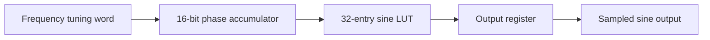

# 16-Bit Direct Digital Synthesis (DDS) Engine

A synthesizable Verilog DDS core that generates a sampled sine wave from a programmable frequency tuning word. The design combines a 16-bit phase accumulator, a 32-entry sine lookup table, and a registered output stage. Changing the tuning word adjusts the output frequency without resetting the phase accumulator.


*Tuning word 300 (about 229 kHz) for 5 us, then 2000 (about 1.53 MHz). The phase accumulator wraps faster and the sine speeds up with no jump in level.*

## How it works



On each clock cycle, the accumulator adds the tuning word to its current phase. The top 5 bits of the phase select one of 32 samples from the sine lookup table, and the output register captures that sample. For a clock frequency of `f_clk` and a tuning word of `FTW`, the nominal output frequency is:

```text
f_out = (FTW / 65,536) x f_clk
```

With a 50 MHz clock, the frequency resolution is about 763 Hz per tuning word step. The 32-entry table limits the waveform's phase resolution, which is why the output is visibly stepped in the waveforms below. The output register adds one clock of latency between the lookup and the module output.

## Design highlights

- **Runtime frequency control:** Change the tuning word while the core is running.
- **Phase continuity:** Tuning changes do not reset the accumulated phase.
- **Synthesizable waveform lookup:** A 32-entry, 8-bit unsigned sine table described with explicit case logic.
- **Registered output:** The sine sample is captured at a clock boundary. The output is unknown (`x`) until the first clock edge after start-up.

## Verification

`sim/nco_tb.v` is a self-contained behavioural testbench. It applies reset, then runs two tuning words with a 50 MHz clock:

| Stage | Tuning word | Output frequency | Duration |
|---|---|---|---|
| 1 | 300 | about 229 kHz | 5 us (a bit over one full cycle) |
| 2 | 2000 | about 1.53 MHz | 2 us (about three full cycles) |

The results below come from this run. The testbench is a visual check of the waveforms; it does not contain automatic pass/fail assertions.

### Start-up

Reset releases at 20 ns, the phase accumulator begins stepping by the tuning word, and the output goes from unknown to mid-scale (`0x80`) on the first clock edge.


### Frequency change and phase continuity

At 5.03 us the tuning word changes from 300 to 2000. The phase step per clock jumps accordingly, but the phase carries on from where it was and the sine continues without a discontinuity. Here the output also shows the one-clock lag behind the lookup table output.


## Running the simulation

Requires [Icarus Verilog](https://steveicarus.github.io/iverilog/) and [GTKWave](https://gtkwave.sourceforge.net/).

```text
cd sim
iverilog -o sim.vvp nco_tb.v ../rtl/nco.v
vvp sim.vvp
gtkwave dump.vcd
```

To view the waveforms as analog signals in GTKWave, right-click `sinewave_output` and `phase`, set **Data Format > Decimal > Unsigned Decimal**, then **Data Format > Analog** (Step for the output, Interpolated for the phase).

## Repository layout

```text
rtl/    Synthesizable DDS module (nco.v)
sim/    Testbench (nco_tb.v)
docs/   Waveform screenshots used in this README
```

Generated files (`*.vcd`, `*.vvp`) are excluded through `.gitignore`.

## Tools

The RTL is written in Verilog and was simulated with Icarus Verilog, with waveforms inspected in GTKWave. The synthesizable design can be taken through an FPGA synthesis flow such as Vivado, though no synthesis or implementation results are included here.

## Project scope

This project demonstrates a compact DDS datapath and simulation-based verification of runtime tuning behaviour. Both tuning words used are well below the Nyquist limit (32768 for a 16-bit accumulator), so aliasing behaviour is not exercised. See the RTL and testbench for signal widths, reset behaviour, and output latency.
